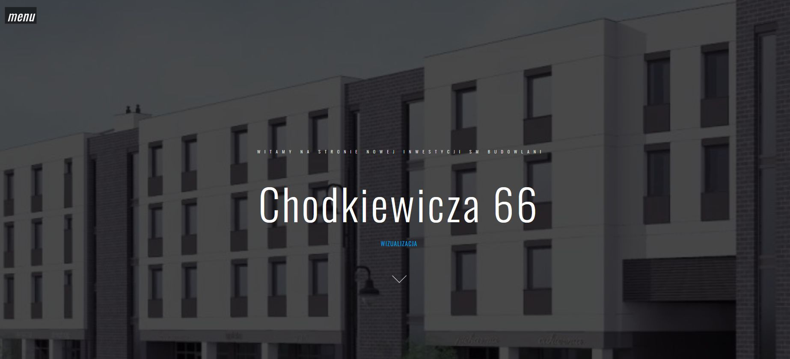

# Dillinger
## _The Last Markdown Editor, Ever_

# Chodkiewicza 66
Website of the latest construction investment of Spółdzielnia Mieszkaniowa Budowlani

## Table of contents
* [General info](#general-info)
* [Screenshots](#screenshots)
* [Technologies](#technologies)
* [Setup](#setup)
* [Features](#features)
* [Status](#status)
* [Inspiration](#inspiration)
* [Contact](#contact)

## General info
Description of the investment, apartment plans, floor plans. List of availability of apartments and garages. Basic information about the construction technology of the building. Visualisation. 

## Screenshots

## Technologies
* HTML 5 
* CSS 3
* PHP
* JS
* Bootstrap

## Setup
https://www.smbudowlani.pl/inwestycja/

## Code Examples
Show examples of usage:
<!--

    <ul id="slide-out" class="side-nav">
        <li>
            

                
                <a href="#!name">SM Budowlani</a>
                <a href="#!email">52 366 44 00</a>
            

        </li>
        <li data-menuanchor="p1" class="active"><a href="#p1"><i class="ion-ios-home-outline" aria-hidden="true"></i>HOME</a></li>
        <li data-menuanchor="p2"><a href="#p2"><i class="ion-ios-person-outline" aria-hidden="true"></i>INWESTYCJA</a></li>
        <li data-menuanchor="p3"><a href="#p3"><i class="ion-ios-gear-outline" aria-hidden="true"></i>TECHNOLOGIA</a></li>
        <li data-menuanchor="p4"><a href="#p4"><i class="ion-ios-list-outline" aria-hidden="true"></i>RZUTY KONDYGNACJI</a></li>
        <li data-menuanchor="p5"><a href="#p5"><i class="ion-ios-albums-outline" aria-hidden="true"></i>RZUTY MIESZKAŃ</a></li>
        <li data-menuanchor="p6"><a href="#p6"><i class="ion-ios-people-outline" aria-hidden="true"></i>HISTORIA</a></li>
        <li data-menuanchor="p7"><a href="#p7"><i class="ion-ios-paperplane-outline" aria-hidden="true"></i>KONTAKT</a></li>
        <li data-menuanchor="p8"><a href="#p8"><i class="ion-ios-location-outline" aria-hidden="true"></i>MAPA</a></li>
        <!--<li class="social">
            <a href="https://pl-pl.facebook.com/pages/category/Community/Sp%C3%B3%C5%82dzielnia-Mieszkaniowa-Budowlani-1458778117748667/"><i class="ion-social-facebook-outline"></i></a>
          -->
            <!--
            <a href="#"><i class="ion-social-instagram-outline"></i></a>
            <a href="#"><i class="ion-social-youtube-outline"></i></a>
          -->
        </li>
    </ul>
    
Projekt/Wykonanie:  <a class="twitter-text-hvr" href="http://golata.eu">IT HELP </a>

-->
## Features
List of features ready and TODOs for future development
To-do list:
* email form

## Status
Project is: _in progress_, 

## Inspiration
Project built on the template with Envato

## Contact
Created by [@ithelparturgolata](ithelparturgolata@gmail.com) - feel free to contact me!
