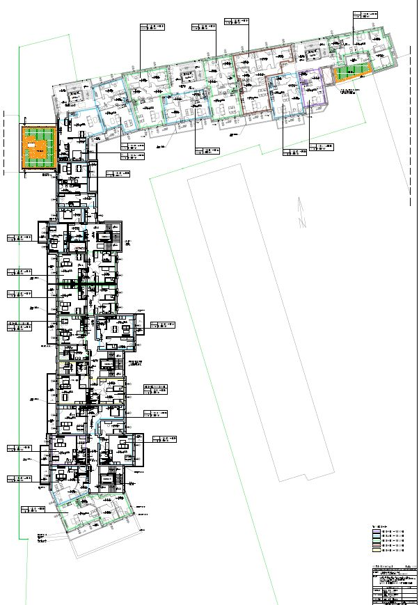

# Dillinger
## _The Last Markdown Editor, Ever_

[](https://nodesource.com/products/nsolid)

[](https://travis-ci.org/joemccann/dillinger)

# Inwestycja SM Budowlani
> Strona www stworzona na potrzeby nowej inwestycji SM Budowlani

## Menu
* [Informacje ogólne](#informacje-oglne)
* [Zrzut ekranu](#zrzut-ekranu)
* [Technologie](#technologie)
* [Instalacja](#instalacja)
* [Kod](#kod)
* [Plan rozwoju](#plan-rozwoju)
* [Status](#status)
* [Inspiracje](#inspiracje)
* [Kontakt](#kontakt)

## Informacje ogólne
Nowa inwestycja. Rzuty mieszkań. Status sprzedazy mieszkań oraz miejsc postojowych. Opis oraz wizualizacja.

## Zrzut ekranu


## Technologie
* PHP
* HTML 5
* JS
* Bootstrap
* CSS

## Instalacja
https://www.smbudowlani.pl/inwestycja/

## Przykładowy kod


```                          <div class="col xl4 l4 m6 s12 mix web">
                            <div class="carousel wow fadeInUp">
                                <a class="carousel-item parent-container-one" href="images/rzuty_kondygnacja/kondygnacja_03.jpg" title="Kondygnacja 3">
                                    
                                    <div class="overlay">

                                        <li class="filter wow fadeIn" data-filter="all">Piętro 3</li>
                                    </div>
                                </a>
                            </div>
```


## Plan rozwoju

* plany miejsc postojowych
* mapa inwestycji

## Status
Status projektu: _in progress_, 

## Inspiracje
Projekt autorski.

## Kontakt
Wykonany przez [@ithelparturgolata](ithelparturgolata@gmail.com) 